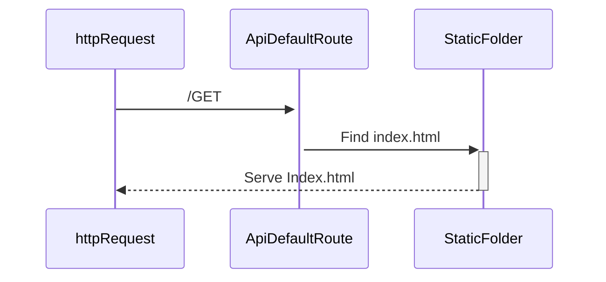
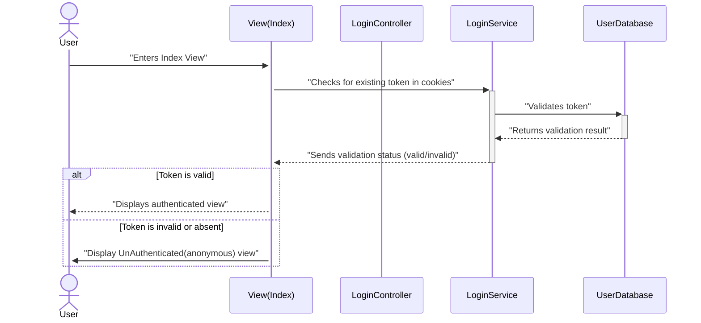
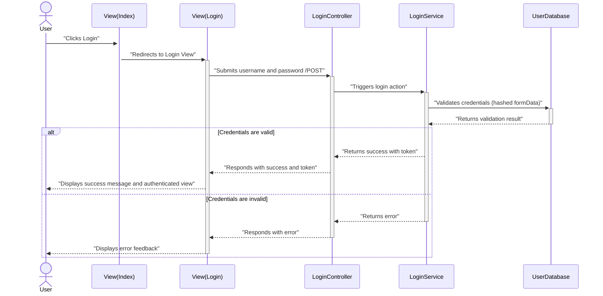
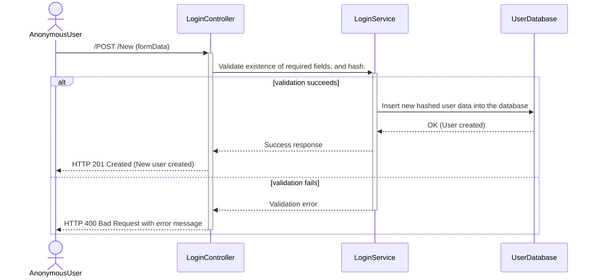
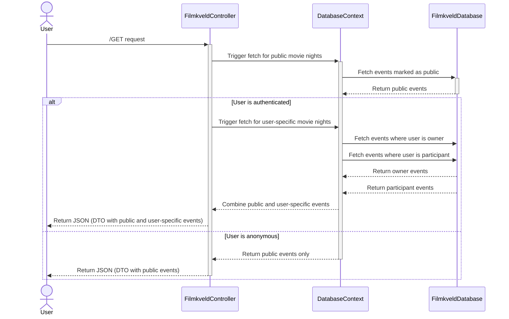
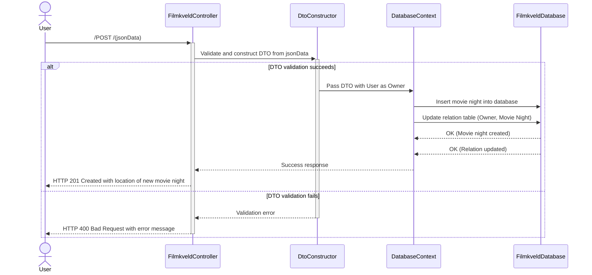
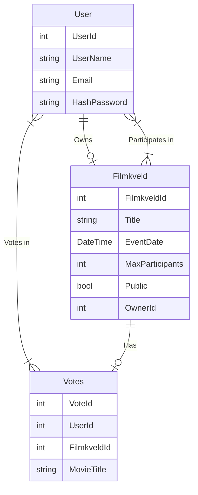

# Filmkveld Planlegger - Project Plan

## What Do We Aim to Achieve?
In the **Filmkveld Planlegger** project, users will:

- Create movie nights, invite their friends, and vote on which movie to watch.
- Join multiple movie nights as a participant.
- Own a movie night as an organizer.
- Use SQLite as the primary data source to manage relationships between users and movie nights.
- The frontend will display different UI elements depending on whether the user is the owner or an invitee of a movie night.

## Data Handling Requirements

- User data (name and email) must be anonymized before storage.
- User passwords will only be stored in a hashed format and never in plaintext.
- Users will receive a token upon login, allowing for session persistence.
- Users can create new accounts and log in.
- The API will ensure secure data transmission using HTTPS.

## Features and Data Models

### Filmkveld (Movie Night):
- **Name**
- **Date and time**
- **Genre**
- **Location**
- **Maximum number of participants**
- **Owner**
- **List of votes**

### User:
- **Name (anonymized)**
- **Email**
- **Password (hashed)**

### Votes:
- **Relationship between user and the selected movie**

## CRUD Operations

### Users:
- **Create:** Create new accounts.
- **Read:** Log in to view movie nights.
- **Update:** Update their passwords.
- **Delete:** Delete their accounts.

### Movie Nights:
- **Create:** Create new movie nights.
- **Read:** List all movie nights.
- **Update:** Update details of a movie night (only by the owner).
- **Delete:** Delete a movie night (only by the owner).

### Votes:
- **Create:** Add a vote to a movie.
- **Read:** View the list of votes.

## Backend: .NET and SQLite

### Entity Framework Core:
- **Models:** User, Filmkveld, Vote.
- **Migrations and database updates** will be managed using Entity Framework.

### Controller Structure:
- **FilmkveldController:** Manages all operations related to movie nights.
- **UserController:** Manages user operations and login functionality.

### DTO (Data Transfer Objects):
- **UserDTO:** For transferring user-related data.
- **FilmkveldDTO:** For transferring movie night-related data.
- **VoteDTO:** For transferring vote-related data.

### Services:
- **Singleton services:**
  - **DatabaseService:** Manages database connections.
  - **LoginService:** Handles user authentication.

## Frontend: HTML, CSS, and JavaScript

### General Layout:
- If the user is not logged in, only public movie nights will be displayed.
- Logged-in users will see the movie nights they own or are invited to.

### Page Structure:
- **Home Page:** Displays a list of movie nights based on the user's login status.
- **Login Page:** Contains forms for user login and registration.
- **Movie Night Details Page:** Provides detailed information about the selected movie night and allows voting.

### Dynamic Data Processing:
- Backend data will be used to generate dynamic content.
- `.map()` and `Object.keys()` will be used to dynamically render lists from the data.

### Login Status:
- A "Log In" button will appear for users who are not logged in.
- Logged-in users will see their username displayed in the navigation bar.

### Forms:
- HTML forms will send user login data via `POST` to the `LoginController`.
- Upon successful login, the user will be redirected to the home page.

## Technologies Used

### Backend:
- **ASP.NET Core**
- **Entity Framework Core**
- **SQLite**
- **JWT (Json Web Token):** For session management.

### Frontend:
- **HTML, CSS, JavaScript**
- **Modern CSS styles** for responsive design.

### Filmkveld Planlegger -Sekvensdiagrammer and Routing

#### **Sekvensdiagrammer**

1. **Default Route to API, standard /GET:**

2. **Sequence for existing login token:**

3. **Sequence for login when token does not exist:**

4. **Sequence for creating a new user:**

5. **Sequence for fetching movie night data on homepage load:**

6. **Sequence for creating a new movie night:**

#### **Entitetsrelasjonsdiagram (ERD):**

#### **Routing Principles:**
We follow the routing principle of `/Area/Controller/Action/Parameter`. For example:
- **Login-related routes:**
  - `/api/Login/Authenticate`
  - `/api/Login/Register`
- **Movie night-related routes:**
  - `/api/Filmkveld/Create`
  - `/api/Filmkveld/GetAll`
  - `/api/Filmkveld/Vote`

